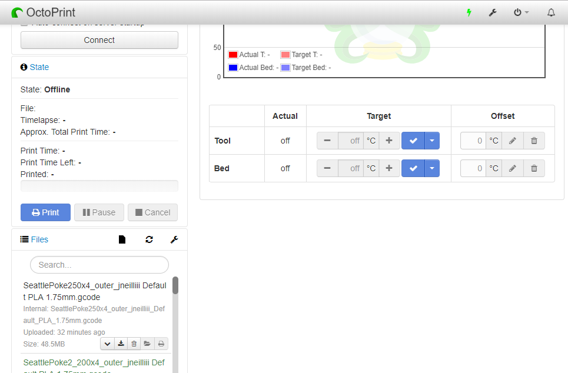

# OctoPrint-FloatingNavbar

Octoprint plugin to make the navbar float on the page/stick to the top while scrolling.

### Setup

Install via the bundled Plugin Manager or manually using this URL:

	https://github.com/jneilliii/OctoPrint-FloatingNavbar/archive/master.zip
	
### Support My Efforts
I programmed this plugin for fun and do my best effort to support those that have issues with it, please return the favor and support me.

